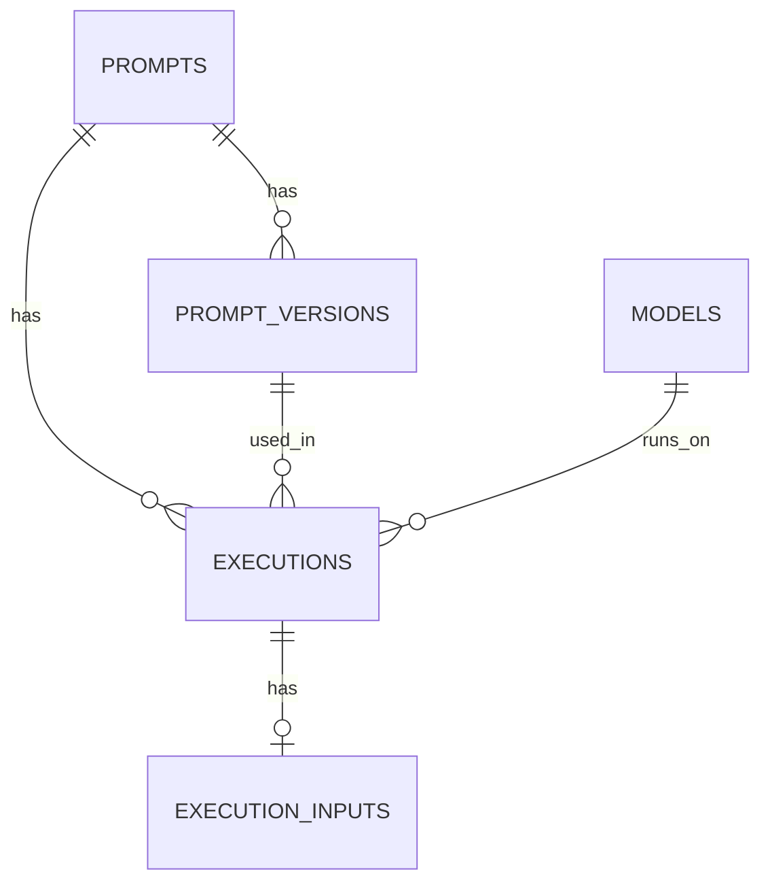

# Prompt Registry, Execution & Lineage Service

**Final Design Specification (MVP)**
Audience: Engineering implementation team / coding assistant
Status: Approved for build

---

## 1. Purpose

This service provides a centralized, governed control plane for GenAI prompts with:

- **Dual-mode prompt management**: Full database management OR code-based tracking
- Prompt registry and content-based versioning
- Multi-provider execution (OpenAI first)
- Async-first production execution with Redis + Celery
- Full execution lineage and telemetry in Postgres
- Deterministic reproducibility (prompt → version → execution)
- **Automatic versioning for code-based prompts** with change detection

The MVP targets **engineering teams** and prioritizes:

- Performance isolation
- Simple governance primitives
- **Flexible prompt management approaches**
- Clean evolution path into a full enterprise platform

Non-goals for MVP: RBAC, evaluation pipelines, dashboards, multi-tenancy, PII governance.

---

## 2. Architectural Decisions (Locked)

| Area | Decision |
|------|----------|
| Execution model | **Async-first** (submit + poll), sync only for dev |
| Queue | **Redis + Celery** |
| Persistence | Postgres; store rendered prompt + response + variables_json |
| Versioning | Checksum-based, dedupe by checksum, active pointer in `prompts` |
| **Prompt Management** | **Dual-mode**: Full database OR code-based tracking |
| Auth | Simple internal API key (`X-API-Key`) |
| Providers | Start with **OpenAI only**, adapter interface |
| Idempotency | `Idempotency-Key` supported on submit/run |

---

## 2.1. Dual-Mode Prompt Management

### Mode 1: Full Management (Traditional)
- Prompts stored and managed in Prompt Ledger database
- Dynamic updates via API/UI
- Non-technical team management
- Real-time template changes

### Mode 2: Code-Based Tracking (New)
- Prompts defined in application code
- Prompt Ledger tracks usage and analytics only
- Automatic versioning via template hash detection
- Git-based version control integration
- Developer-centric workflow

### Unified Interface
Both modes support identical execution APIs:
```python
# Same interface, different backend behavior
result = ledger.execute("prompt_name", variables)
analytics = ledger.get_usage_stats("prompt_name")
```

---

## 3. High-Level Architecture

```
Client
  │
  ▼
Prompt Registry & Execution API (FastAPI)
  │           │
  │           ├── Registry ops → Postgres
  │           │
  │           └── Submit execution → Redis (Celery)
  │
  ▼
Worker Pool (Celery)
  │
  └── Provider Adapter (OpenAI)
           │
           ▼
        OpenAI API
```

Control plane: prompts, versions, models
Data plane: executions (append-heavy, async)

---

## 4. Execution Model

### 4.1 Sync (Dev / Interactive)
- Endpoint: `POST /v1/executions:run`
- Inline provider call
- Writes execution row with `mode=sync`
- Returns response immediately

### 4.2 Async (Production default)

Flow:
1. Client → `POST /v1/executions:submit`
2. Service resolves active version
3. Renders prompt using Jinja
4. Writes execution row: `status=queued`, `mode=async`
5. Enqueues `{execution_id}` to Redis
6. Worker executes, updates row to `succeeded` or `failed`
7. Client polls `GET /v1/executions/{id}`

Retries:
- Max 3 retries
- Exponential backoff (5s, 30s, 2m)
- Retry on: timeouts, 429, 5xx
- No retry on: other 4xx

---

## 5. Rendering Rules

- Engine: Jinja2
- Undefined variables: **error (fail fast)**
- Store both:
  - `rendered_prompt` (TEXT)
  - `variables_json` (JSONB)

Rendering occurs **before enqueue** for reproducibility and simplicity.

---

## 6. Versioning Rules

1. Compute `checksum_hash = sha256(template_source)`
2. If a version exists with same `(prompt_id, checksum_hash)`:
   - Reuse existing version (no new version number)
3. If checksum is new:
   - Create new version with `version_number = max + 1`
4. If `set_active = true`:
   - Update `prompts.active_version_id`

Guarantees:
- Same content = same version
- Version increments only on content change
- Full historical trace preserved

---

## 7. Postgres Schema (Authoritative)

### 7.1 Enumerations
```sql
CREATE TYPE prompt_version_status AS ENUM ('draft', 'active', 'deprecated');
CREATE TYPE execution_mode AS ENUM ('sync', 'async');
CREATE TYPE execution_status AS ENUM ('queued', 'running', 'succeeded', 'failed', 'canceled');
CREATE TYPE provider_name AS ENUM ('openai');
```

---

### 7.2 Prompts
```sql
CREATE TABLE prompts (
  prompt_id           UUID PRIMARY KEY DEFAULT gen_random_uuid(),
  name                TEXT NOT NULL UNIQUE,
  description         TEXT,
  owner_team          TEXT,
  created_at          TIMESTAMPTZ NOT NULL DEFAULT now(),
  updated_at          TIMESTAMPTZ NOT NULL DEFAULT now(),
  active_version_id   UUID NULL
);
```

---

### 7.3 Prompt Versions
```sql
CREATE TABLE prompt_versions (
  version_id        UUID PRIMARY KEY DEFAULT gen_random_uuid(),
  prompt_id         UUID NOT NULL REFERENCES prompts(prompt_id) ON DELETE CASCADE,
  version_number    INT  NOT NULL,
  status            prompt_version_status NOT NULL DEFAULT 'draft',
  template_source   TEXT NOT NULL,
  checksum_hash     TEXT NOT NULL,
  created_by        TEXT,
  created_at        TIMESTAMPTZ NOT NULL DEFAULT now(),

  CONSTRAINT uq_prompt_version UNIQUE(prompt_id, version_number),
  CONSTRAINT uq_prompt_checksum UNIQUE(prompt_id, checksum_hash)
);
```

---

### 7.6 Executions (Unified)
```sql
CREATE TABLE executions (
  execution_id        UUID PRIMARY KEY DEFAULT gen_random_uuid(),

  prompt_id           UUID NOT NULL REFERENCES prompts(prompt_id),
  version_id          UUID NOT NULL REFERENCES prompt_versions(version_id),
  model_id            UUID NOT NULL REFERENCES models(model_id),

  environment         TEXT NOT NULL DEFAULT 'dev',

  execution_mode      TEXT NOT NULL CHECK (execution_mode IN ('sync', 'async')),
  status              TEXT NOT NULL DEFAULT 'queued',

  correlation_id      TEXT,
  idempotency_key     TEXT,

  rendered_prompt     TEXT NOT NULL,
  variables_json      JSONB NOT NULL,
  response_text       TEXT,

  temperature         DOUBLE PRECISION,
  top_k               INT,
  top_p               DOUBLE PRECISION,
  repetition_penalty  DOUBLE PRECISION,
  max_new_tokens      INT,

  prompt_tokens       INT,
  response_tokens     INT,
  latency_ms          INT,
  error_type          TEXT,
  error_message       TEXT,

  created_at          TIMESTAMPTZ NOT NULL DEFAULT now(),
  started_at          TIMESTAMPTZ,
  completed_at        TIMESTAMPTZ
);
```

---

### 7.7 Models
```sql
CREATE TABLE models (
  model_id            UUID PRIMARY KEY DEFAULT gen_random_uuid(),
  provider            provider_name NOT NULL,
  model_name          TEXT NOT NULL,
  max_tokens          INT,
  supports_streaming  BOOLEAN NOT NULL DEFAULT false,
  created_at          TIMESTAMPTZ NOT NULL DEFAULT now(),
  UNIQUE(provider, model_name)
);
```

---

### 7.8 Execution Inputs
```sql
CREATE TABLE execution_inputs (
  execution_id   UUID PRIMARY KEY REFERENCES executions(execution_id) ON DELETE CASCADE,
  variables_json JSONB NOT NULL
);
```

---

## 8. ERD



---

## 9. API Specification (Authoritative)

### Auth

Header required on all endpoints:

```
X-API-Key: <internal-key>
```

---

### 9.1 Prompt Upsert

`PUT /v1/prompts/{name}`

Request:
```json
{
  "description": "Summarize documents",
  "owner_team": "AI-Platform",
  "template_source": "Summarize:\n{{text}}",
  "created_by": "martin",
  "set_active": true
}
```

Response:
```json
{
  "prompt": {"prompt_id": "uuid", "name": "doc_summarizer"},
  "version": {"version_id": "uuid", "version_number": 3},
  "version_change": true
}
```

---

### 9.2 List Versions

`GET /v1/prompts/{name}/versions`

---

### 9.3 Execute Sync

`POST /v1/executions:run`

Request:
```json
{
  "prompt_name": "doc_summarizer",
  "version_number": null,
  "environment": "dev",
  "variables": {"text": "..."},
  "model": {"provider": "openai", "model_name": "gpt-4.1-mini"},
  "params": {"max_new_tokens": 800, "temperature": 0.2}
}
```

Response:
```json
{
  "execution_id": "uuid",
  "status": "succeeded",
  "mode": "sync",
  "response_text": "...",
  "telemetry": {"prompt_tokens": 120, "response_tokens": 80, "latency_ms": 950}
}
```

---

### 9.4 Execute Async

`POST /v1/executions:submit`

Same request body as sync.

Response:
```json
{
  "execution_id": "uuid",
  "status": "queued",
  "mode": "async"
}
```

---

### 9.5 Poll Execution

`GET /v1/executions/{execution_id}`

Response:
```json
{
  "execution_id": "uuid",
  "status": "succeeded",
  "mode": "async",
  "response_text": "...",
  "telemetry": {"prompt_tokens": 120, "response_tokens": 80, "latency_ms": 950}
}
```

---

## 10. Code-Based Prompt APIs (Tracking Mode)

### 10.1 Register Code Prompts

`POST /v1/prompts/register-code`

Request:
```json
{
  "prompts": [
    {
      "name": "WELCOME",
      "template_source": "Hello {{name}}, welcome to {{app}}!",
      "template_hash": "abc123..."
    },
    {
      "name": "ORDER_CONFIRMATION",
      "template_source": "Order {{order_id}} confirmed!",
      "template_hash": "def456..."
    }
  ]
}
```

Response:
```json
{
  "registered": [
    {
      "name": "WELCOME",
      "mode": "tracking",
      "version": 2,
      "change_detected": true,
      "previous_version": 1
    },
    {
      "name": "ORDER_CONFIRMATION",
      "mode": "tracking",
      "version": 1,
      "change_detected": false,
      "previous_version": null
    }
  ]
}
```

### 10.2 Execute Code Prompt

`POST /v1/prompts/{name}/execute`

Request:
```json
{
  "variables": {"name": "John", "app": "MyApp"},
  "version": null,  // optional, defaults to latest
  "model_name": "gpt-3.5-turbo",
  "mode": "sync"
}
```

Response:
```json
{
  "execution_id": "uuid",
  "prompt_name": "WELCOME",
  "prompt_mode": "tracking",
  "version_used": 2,
  "response_text": "Hello John, welcome to MyApp!",
  "telemetry": {"prompt_tokens": 15, "response_tokens": 8, "latency_ms": 450}
}
```

### 10.3 Get Prompt History (Works for Both Modes)

`GET /v1/prompts/{name}/history?mode=tracking`

Response:
```json
{
  "prompt_name": "WELCOME",
  "mode": "tracking",
  "current_version": 2,
  "versions": [
    {
      "version": 2,
      "template_hash": "abc123...",
      "template_source": "Hello {{name}}, welcome to {{app}}!",
      "created_at": "2024-01-15T10:30:00Z",
      "execution_count": 150
    },
    {
      "version": 1,
      "template_hash": "xyz789...",
      "template_source": "Welcome {{name}}!",
      "created_at": "2024-01-10T09:15:00Z",
      "execution_count": 85
    }
  ]
}
```

### 10.4 Unified Analytics (Both Modes)

`GET /v1/analytics/prompts?mode=all`

Response:
```json
{
  "summary": {
    "total_executions": 1250,
    "full_mode_prompts": 8,
    "tracking_mode_prompts": 12
  },
  "by_mode": {
    "full": {
      "execution_count": 800,
      "avg_latency_ms": 950
    },
    "tracking": {
      "execution_count": 450,
      "avg_latency_ms": 420
    }
  }
}
```

---

## 11. Worker Contract

Queue payload:
```json
{"execution_id": "uuid"}
```

Worker steps:
1. Load execution row
2. Mark `status=running`, set `started_at`
3. Call provider adapter
4. Update:
   - `response_text`
   - tokens, latency
   - `status=succeeded`
   - `completed_at`
5. On failure:
   - write `error_type`, `error_message`
   - `status=failed`

---

## 11. Provider Adapter Interface

```python
class ProviderAdapter:
    def generate(self, rendered_prompt: str, model_name: str, params: dict) -> dict:
        """
        Returns:
          {
            "response_text": str,
            "prompt_tokens": int | None,
            "response_tokens": int | None,
            "latency_ms": int,
            "provider_request_id": str | None
          }
        """
```

OpenAI adapter responsibilities:
- Map params to OpenAI API
- Capture token usage
- Measure latency

---

## 12. Truncation & Limits

Defaults:
- Max rendered_prompt: 200 KB
- Max response_text: 500 KB

If exceeded:
- Truncate
- Set `error_type = "truncated"`

---

## 13. Observability (MVP)

Log per execution:
- execution_id
- provider
- model_name
- latency
- token counts
- status

Future hooks:
- Prometheus counters
- Cost aggregation

---

## 14. Roadmap Hooks (Do NOT implement now)

Reserved fields and tables already support:
- Multi-provider
- Evaluation tables
- RBAC columns
- Partitioned execution tables

---

## 15. Definition of Done (MVP)

The system is complete when:

- Prompts can be registered and versioned via API
- Active version resolution works
- Async submit + worker execution works
- Polling returns results
- Executions are fully traceable in Postgres
- Idempotency prevents duplicate executions
- OpenAI adapter works end-to-end

---

## 16. Summary Positioning

This service implements an **enterprise-grade Prompt Registry, Execution and Lineage Control Plane** with:

- Deterministic versioning
- Provider-agnostic execution
- Async-first production design
- Full reproducibility and audit trail

Designed to evolve into a full GenAI governance platform without re-architecture.
